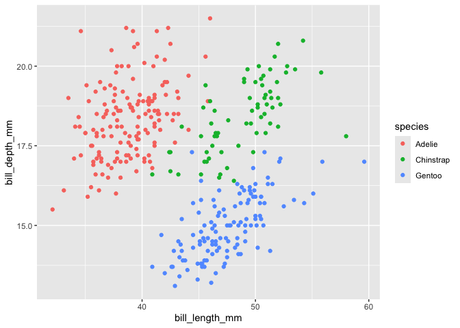

# Week 6 Online Lec
Madigan Boborci

<script src="OnlineLectureWork_files/libs/kePrint-0.0.1/kePrint.js"></script>
<link href="OnlineLectureWork_files/libs/lightable-0.0.1/lightable.css" rel="stylesheet" />

## Introduction:

This document is for the topics being taught in the online lecture.

``` r
library(tidyverse)
library(here)
library(palmerpenguins)
library(kableExtra)
```

## Look at the data

``` r
glimpse(penguins)
```

    Rows: 344
    Columns: 8
    $ species           <fct> Adelie, Adelie, Adelie, Adelie, Adelie, Adelie, Adel…
    $ island            <fct> Torgersen, Torgersen, Torgersen, Torgersen, Torgerse…
    $ bill_length_mm    <dbl> 39.1, 39.5, 40.3, NA, 36.7, 39.3, 38.9, 39.2, 34.1, …
    $ bill_depth_mm     <dbl> 18.7, 17.4, 18.0, NA, 19.3, 20.6, 17.8, 19.6, 18.1, …
    $ flipper_length_mm <int> 181, 186, 195, NA, 193, 190, 181, 195, 193, 190, 186…
    $ body_mass_g       <int> 3750, 3800, 3250, NA, 3450, 3650, 3625, 4675, 3475, …
    $ sex               <fct> male, female, female, NA, female, male, female, male…
    $ year              <int> 2007, 2007, 2007, 2007, 2007, 2007, 2007, 2007, 2007…

## Making Plots

This plot will look at the relationship between **bill length** and
**bill depth**.

``` r
penguins %>%  # peguin dataset
  ggplot(aes(x=bill_length_mm, y=bill_depth_mm, color=species))+   #bill length vs depth
  geom_point() 
```

<div id="fig-penguin">



Figure 1: This is a figure showing bill length by bill depth

</div>

When you look at <a href="#fig-penguin" class="quarto-xref">Figure 1</a>
you can see a positive relationship between bill length and bill depth.

``` r
penguins%>%
  group_by(species) %>%
  summarise(billmeanlength=mean(bill_length_mm, na.rm=TRUE))%>%   #find mean bill length by species
  kbl()%>%     # makes a kable table
  kable_classic()%>%   #one of the kbl themes
  row_spec(2, bold=TRUE, color="white",background="red")%>%    #highlights specified row
  kable_styling(full_width = FALSE)      #makes it so it doesn't take up full row of space
# I cannot figure out why it doesn't want to render properly, only does full length and highlight on my local host, and only does shortened length and no highlight as html
```

<div id="tbl-penguin">

Table 1: My penguin table

<div class="cell-output-display">

| species   | billmeanlength |
|:----------|---------------:|
| Adelie    |       38.79139 |
| Chinstrap |       48.83382 |
| Gentoo    |       47.50488 |

</div>

</div>

<a href="#tbl-penguin" class="quarto-xref">Table 1</a> shows the mean
bill length by species
